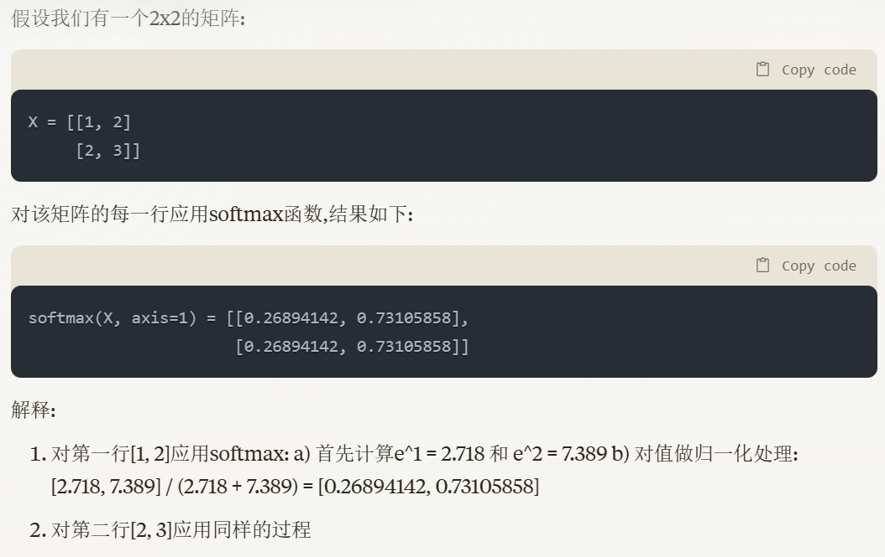
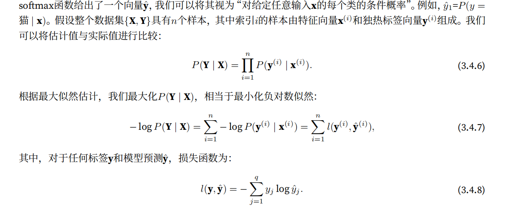

# softmax回归
我们不可以将为规范化的预测值作为我们的输出标准，因为将线性层的输出直接视为概率时存在一些问题：一方面，我们没有限制这些输出数字的总和为1。另一方面，根据输入的不同，它们可以为负值。这些违反了概率基本公理。

所以引入softmax回归

具体来说,softmax回归模型由两部分组成:

## 线性函数部分: 
这部分将输入特征X与相应的权重W做线性组合,然后加上一个偏置项b,得到一个原始评分向量z = (z1, z2, ..., zk),其中k是类别的总数。 z = X * W + b
## softmax函数部分: 
对线性函数部分的输出z进行softmax变换,将其转换为一个值在[0,1]区间内的概率向量。 softmax(z)i = exp(zi) / sum(exp(zj)) for j=1,...,k

** 尽管softmax是一个非线性函数，但softmax回归的输出仍然由输入特征的仿射变换决定 **

## 小批量样本的矢量化

这里面的+b用了广播机制，还是每一个都会加上b
### 对于举证用softmax回归的过程是：
对于O的每一行，我们先对所有项进行幂运算，然后通过求和对它们进行标准化

## 损失函数
这个还是用最大似然估计，用对数似然，这里的似然函数就是损失函数

这里的yj代表真实one-hot标签向量,对于一个K分类问题:

如果样本的真实类别是j,则yj=1
如果样本的真实类别不是j,则yj=0

* 其中的l 损失函数是交叉熵损失函数 cross‐entropy loss *

假如我们将softmax归一化之后的估计值带入计算

这里梯度是梯度是观测值y和估计值yˆ之间的差异，这就让对数似然的梯度计算十分简单。

而对于分类问题的交叉熵函数变得更加简单了，由于y只有0，1所以我们只用关注y=1处的点即可，一般就只用计算一次即可

之后我们将通过信息论基础来理解交叉熵损失

## 信息论
### 熵
该数值被称为分布P的熵

信息论的基本定理之一指出，为了对从分布p中随机抽取的数据进行编码，我们至少需要H[P]“纳特（nat）”对其进行编码
这里的nat就类似于bit是一种储存的计量方式

### 信息量
我们不能完全预测每一个事件，那么我们有时可能会感到“惊异”。克劳德·香农决定用信息量
去量化这种诧异程度

在观察一个事件j时，并赋予它（主观）概率P(j)。当我们赋予一个事件较低的概率时，我们的惊异会更大，该事件的信息量也就更大

### 交叉熵

简单来说就是类似于条件概率

