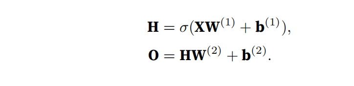
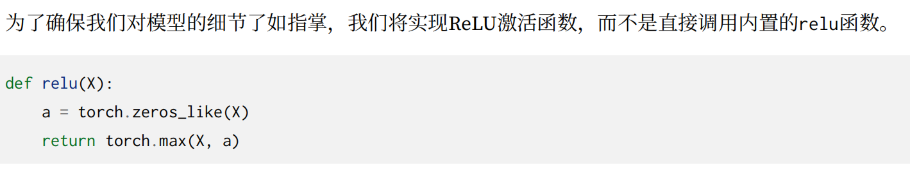

# 多层感知机
在之前的实现过程中，我们用的都是线性的model，这是一个不通用的假设，大部分都不是线性的。
我们可以在输入层和输出层之间添加隐藏层，从而克服线性模型的不足，这种架构通常称为多层感知机

提问这种改变有用吗

毛用没有，这个和之前的线性model是一个东西，我们可以用之前的线性模型表示所有的这种仿射变换

所以我们得发挥出多层的用处，在每一次的仿射变换之后添加非线性的激活函数

一般来说有了激活函数就不会退化成为线性函数
如果想要构建更加通用的多层感知机，可以添加更多的激活函数和隐藏层

## 激活函数

### relu函数

这个relu函数还有好多的变式

## sigmoid函数

可以将任意范围的输出变成（0，1）的区间

## tanh函数
（双曲正切函数）

# 多层感知机的实现
还是用minst去实现这个代码

## 初始化模型参数

这里我们用的隐藏层的输出参数是256，这个也是可以改变的，但是一般用二的倍数去写，这和内存的机制有关，有利于内存的工作

## 实现rule

没什么好说的，比较容易实现的

## 实现net
我们这里将空间结构忽视，所以先得展开成一个一维的向量
之后就是隐藏层的一些经典操作，别忘了放到激活函数里面

## 利用高级api实现多层感知机

# 过拟合
## 训练误差和泛化误差
训练误差（training error）是指，模型在训练数据集上计算得到的误差。
泛化误差（generalization error）是指，模型应用在同样从原始样本的分布中抽取的**无限多**数据样本时，模型误差的期望。

我们无法算出泛化误差，只可以通过测试集去估计。

# 统计学习理论
我们希望训练数据和测试数据都是从相同的分布中独立提取的。这通常被称为独立同分布假设（i.i.d. assumption），这意味着对数据进行采样的过程没有进行“记忆”。

## k折交叉验证

# 权重衰减
## 线代知识

L1范数：向量元素的绝对值之和（相比于L2收异常值影响更小）

L2范数：向量元素和的平方根

## 正则化
正则化用于防止过拟合的技术,有助于提高模型在新数据上的泛化能力。

权重衰减是一种常用的正则化手段，也别称为L2正则化
## L2正则化
通过函数与零的距离来衡量函数的复杂度。但是计算这个并不容易，一种简单的方法是通过线性函数 $$ f(x) = w^⊤x $$中的权重向量的某个范数来度量其复杂性,例如$$||w||^2$$,我们要保住这个权重向量足够的小，一种方法是**将他作为惩罚项加入到损失函数中**，将原来的训练目标最小化训练标签上的预测损失，**调整为最小化预测损失和惩罚项之和。**

现在如果说如果我们的权重向量增长的太大，我们的学习算法可能会更集中于最小化权重范数$$∥w∥^2$$。这正是我们想要的

在之前的线性回归中，我们的损失函数是

现在我们可以向其中假如权重向量

**λ是一个非负超参数**，这里我们仍然除以2是因为：当我们取一个二次函数的导数时，2和1/2会抵消，以确保更新表达式看起来既漂亮又简单。为什么在这里我们使用平方范数而不是标准范数（即欧几里得距离,带根号）？我们这样做是为了便于计算。

# 高维线性回归实现

## 生成数据
~~~
import torch
from torch import nn
from d2l import torch as d2l

n_train, n_test, num_inputs, batch_size = 20, 100, 200, 5
true_w, true_b = torch.ones((num_inputs, 1)) * 0.01, 0.05
train_data = d2l.synthetic_data(true_w, true_b, n_train)
train_iter = d2l.load_array(train_data, batch_size)
# load_array这个函数将数据集分为小批次，每次返回这个小批次

test_data = d2l.synthetic_data(true_w, true_b, n_test)
test_iter = d2l.load_array(test_data, batch_size, is_train=False)
~~~

按照这个公式生成数据

## 初始化模型参数
~~~
w = torch.normal(0 , 1 , size = (num_inputs , 1) , requires_grad= True)
b = torch.zeros(1 , requires_grad= True)
#这里可不要直接写 b=0 了，这样是没法求梯度的
params = [w,b]
~~~

## 定义惩罚
~~~
def l2_penalty(w):
    return torch.sum(w.pow(2)) / 2
#L2范数惩罚的实现
~~~

## 训练代码

~~~
lr = 0.01
loss = nn.MSELoss()
net = nn.Sequential(nn.Linear(200,1))
updater = torch.optim.SGD(net.parameters(), lr=lr)

def train(lambd):
    #lambd是超参数
    epochs = 100
    for i in range(epochs):
        for x, y in train_iter:
            updater.zero_grad()
            y_train = net(x)
            
            l = loss(y_train , y) + lambd * l2_penalty(w)
            l.backward()
            updater.step()

train(1)
~~~

## 高级api实现
~~~

def train_concise(wd):
    net = nn.Sequential(nn.Linear(num_inputs, 1))
    #创建一个神经网路，里面只有一个线性层
    for param in net.parameters():
        param.data.normal_()
    #对线性层的所有参数初始化（其实也就是w和b）
    #使用均值为0、标准差为1的正态分布初始化
    loss = nn.MSELoss(reduction='none')
    num_epochs, lr = 100, 0.003
    # 偏置参数没有衰减
    trainer = torch.optim.SGD([
        {"params":net[0].weight,'weight_decay': wd},
        {"params":net[0].bias}], lr=lr)
    """
    net[0].weight是神经网络第一层(在这种情况下是唯一一层)的权重张量
    'weight_decay': wd指定了该层权重的权重衰减(weight decay)系数为wd
    """
    animator = d2l.Animator(xlabel='epochs', ylabel='loss', yscale='log',
                          xlim=[5, num_epochs], legend=['train', 'test'])
    #画图用的
    for epoch in range(num_epochs):
        for X, y in train_iter:
            trainer.zero_grad()
            l = loss(net(X), y)
            l.mean().backward()
            #因为前面有reduction=none所以要加.mean
            trainer.step()
    if (epoch + 1) % 5 == 0:
        animator.add(epoch + 1,
        (d2l.evaluate_loss(net, train_iter, loss),
         d2l.evaluate_loss(net, test_iter, loss)))
    print('w的L2范数：', net[0].weight.norm().item())

~~~

# 暂退法
**可以解决过拟合这个问题**

在前向传播过程中，计算每一内部层的同时注入噪声
用来增强函数的平滑性

神经网络过拟合与每一层都依赖于前一层激活值相关，称这种情况为“共适应性”。而暂退法会破坏共适应性

## 实践中的暂退法

中间活性值就是网络的隐藏层（中间层）中计算得到的值
要求期望保持不变是为了不引入额外的偏差

## 代码实现

### dropout
~~~
def drop_out(X , drop_rate):

    if drop_rate == 1:
    #所有数据都会被drop
        return torch.zeros_like(X)
    if drop_rate == 0:
    #所有数据都会被保留
        return X
    mask = (torch.rand(X.shape) > drop_rate).float()
    return mask * X / (1 - drop_rate)
~~~

### 定义module
~~~
class net(nn.Module):
    def __init__(self, num_inputs, num_outputs, num_hiddens1, num_hiddens2,
                is_training = True):
        super(net,self).__init__()
        #调用Mudule的init去调用父辈的构造函数
        self.num_inputs = num_inputs
        self.training = is_training

        #如果is_training=True,模型将处于训练模式,否则处于评估模式

        self.lin1 = nn.Linear(num_inputs, num_hiddens1)
        self.lin2 = nn.Linear(num_hiddens1, num_hiddens2)
        self.lin3 = nn.Linear(num_hiddens2, num_outputs)
        self.relu = nn.ReLU()
~~~

### 定义连接代码
~~~
def train_itself(self, x):
        h1 = self.lin1(x.reshape(-1 , num_inputs))
        h1 = self.relu(h1)
        #只有在训练的时候才有dropout
        if self.train == True:
            h1 = drop_out(h1 , drop1)
            # 在第一个全连接层之后添加一个dropout层
        h2 = self.lin2(h1.reshape(-1 , num_hiddens1))
        h2 = self.relu(h2)
        if self.train == True:
            h2 = drop_out(h2 , drop2)
            # 在第二个全连接层之后添加一个dropout层
        out = self.lin3(h2)
        return out
~~~
**之后的训练代码看drop_out那里就ok**

# 前向传播

从上面这个计算图可以看出这个是如何工作的

## 梯度消失和梯度爆炸

所以梯度是M（L~1）和V相乘，这个容易受数值下溢的影响。
不稳定梯度也威胁到我们优化算法的稳定性。我们可能面临一些问题。
要么是梯度爆炸（gradient exploding）问题：参数更新过大，破坏了模型的稳定收敛；
要么是梯度消失（gradient vanishing）问题：参数更新过小，在每次更新时几乎不会移动，导致模型无法学习

### 从sigmoid函数
1/(1 + exp(−x))这个函数就容易导致梯度消失

可以看到在数值过大或者过小的时候会导致梯度趋近于0，从而不能学习
所以现在更青睐于softmax

## 对称性
如果我们将隐藏层的所有参数初始化为W(1) = c，c为常量，会发生什么？
在这种情况下，在前向传播期间，两个隐藏单元采用相同的输入和参数，产生相同的激活，该激活被送到输出单元。
在反向传播期间，根据参数W(1)对输出单元进行微分，得到一个梯度，其元素都取相同的值。
所以W永远不会被改变
**权重衰减和dropout**可以打破这个对称性