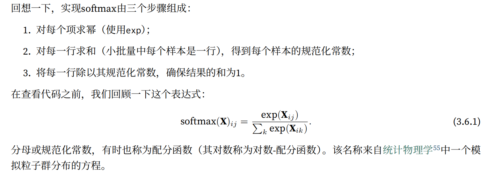

# minst手写识别实现
现在来进行最经典的minst手写识别问题的实现

导入包就不写了
## 读取数据集
~~~
trans = transforms.ToTensor()
#将图像数据转化为tensor，并且会有归一化，即除以255使得所有像素的数值均在0～1之间
mnist_train = torchvision.datasets.FashionMNIST(
root="../data", train=True, transform=trans, download=True)
mnist_test = torchvision.datasets.FashionMNIST(
root="../data", train=False, transform=trans, download=True)
~~~
这里我们用的是Fashion‐MNIST数据集，这个数据更强
这里test和train的数据都是给你处理好的，输出len(minst_train)可以看到是60000

这个数据集包含：t‐shirt、trouser、pullover、dress、coat、sandal、shirt、sneaker、bag、ankle boot，这些是标签，所以我们需要把这些标签和数字索引进行转换

### 索引转换

之后书中讲解了如何可视化现实这些图片，这里不做讲解
### 读取数据
这里主要看一下这个多进程读取是什么意思

### 数据读取总结

这个代码我们实现了可以转换图形的大小，并且下载读取的功能

# softmax回归实现minst
## 数据处理
和之前的线性回归一样，我们需要把数组转换成一维的向量，之后把多个向量加成矩阵，从而实现gpu加速计算
在softmax回归中，我们的输出于类别一样多 ———— 在minst中是10

所以说输出维度是10

每个样本都是28×28的图像，本节将展平每个图像，把它们看作长度为784的向量
因此，权重将构成一个784 × 10的矩阵，偏置将构成一个1 × 10的行向量

## 定义softmax操作

先回忆一下sum是如何操作的
这里keepim参数是保留维度的意思，（1，3）和（3，）tensor是不一样的，前者是二维的后者是一维的，[[1,2,3]]是1，3 ， [1,2,3]是3，

这是写出的code

## 定义模型

没什么好说的，直接看代码就OK

## 定义loss函数
我们只需要一句话就可以定义
~~~
def cross_entropy(y_hat, y):
    #比如说y = torch.tensor([0, 2])，代表的是第一个数据分类是0（第一个），第二个数据分类是2（第三个）
    return - torch.log(y_hat[range(len(y_hat)), y])
    #range(len(y_hat))指的是选择每一行，range(len(y_hat))，y指的是选择每一行上对应y位置的数
~~~
对于torch.log(y_hat[range(len(y_hat)), y])可以用这个去理解

因为交叉熵的定义式是

所以在分类问题中我们只用计算y=1处即可，其他地方都是0
## 精度计算

之后只用➗len(y)就可以得出最后的结果

同样，对于任意数据迭代器data_iter可访问的数据集，我们可以评估在任意模型net的精度

其中的accumulate是定义了一个对多个变量实现累加的类，为了简化代码

## 训练
这里没什么好说的，主要注意这里是对l求mean（平均值），当然也可以写成sum  

